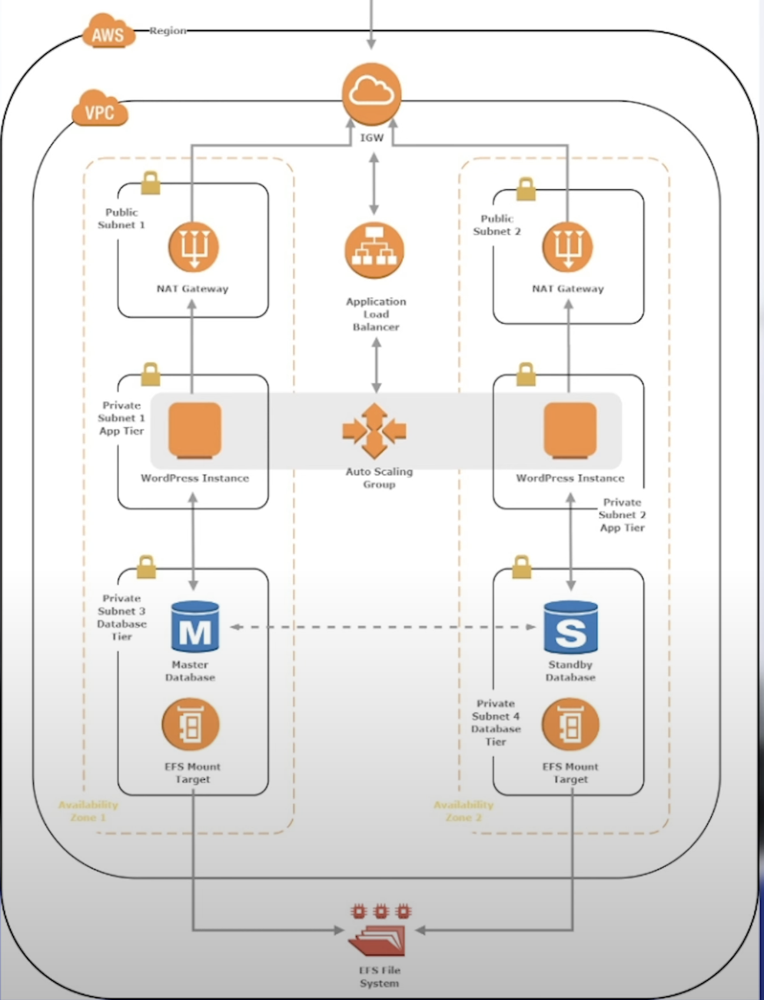

# Highly Available WordPress Application

----

## Project Overview

This project demonstrates the deployment of a highly available WordPress application using a three-tier architecture on AWS. The architecture ensures high availability, fault tolerance, and scalability by leveraging AWS services such as VPC, RDS, ElastiCache, EFS, and Auto Scaling.

## Architecture

The architecture consists of three tiers:
1. **Network Tier**: VPC with subnets and routing configurations.
2. **Data Tier**: Managed database, caching, and shared filesystem.
3. **Application Tier**: Load balancer, auto-scaling group, and WordPress servers.

## Network Configuration

### Create the Network

- **VPC**: Created a VPC named "WordPress-VPC".
- **Subnets**: Created 6 subnets:
  - 2 Public Subnets
  - 2 Application Subnets
  - 2 Data Subnets
- **Internet Gateway**: Attached an Internet Gateway to the VPC.
- **NAT Gateways**: 
  - Created two NAT Gateways, one in each public subnet.
  - Configured route tables for the Application subnets to use the NAT Gateways as the default gateway.
  - Associated the route tables with the Application subnets.

The network setup ensures that resources in the public subnets are accessible from the internet, while resources in the Application and Data subnets can communicate internally and access the internet via the NAT gateways.

## Data Tier Configuration

### Build RDS Database

- **Security Groups**: Created two security groups for the client database and the main database. Configured inbound rules to allow traffic from the client database security group.
- **RDS Subnet Group**: Created an RDS subnet group specifying the subnets for database deployment.
- **Aurora Database Cluster**: Created an Aurora database cluster connected to the VPC and DB subnet group.

### Configure ElastiCache for Memcached

- **Security Groups**: Created cache security groups for the cache client and main cache. Configured inbound rules to allow traffic from the cache client security group.
- **ElastiCache Instance**: Configured a Memcached instance and added a subnet group with the Data subnets and the main cache security group.

### Create the Shared Filesystem

- **Security Groups**: Created filesystem security groups for the EFS. Configured inbound rules to allow traffic from the FS client security group to the main FS security group.
- **EFS Cluster**: Configured an EFS cluster and mounted the Application subnets to each AZ, adding the FS security group to both.

The data tier setup provides a shared filesystem, a highly available database, and a caching layer to improve application performance.

## Application Tier Configuration

### Create the Load Balancer

- **Security Group**: Created a security group for the load balancer, allowing HTTP traffic on port 80 from my IP.
- **Load Balancer**: Configured a load balancer to distribute traffic across EC2 instances in different AZs.

### Create a Launch Template

- **Security Group**: Created a security group for WordPress servers, allowing HTTP traffic from the load balancer security group.
- **Launch Template**: Configured a launch template for auto-scaling groups, including a user data script with EFS, DB details, and security groups (WP cache client, WP DB client, WP EFS client, WP WordPress).

### Create the Application Server

- **Auto Scaling Group**: Created an auto-scaling group for WordPress application servers, enabling automatic scaling based on traffic.

The application tier setup allows for a highly available and scalable WordPress deployment that responds to client traffic dynamically.

## Summary

- **Network**: Created a software-defined network with VPC, subnets, and NAT gateways across multiple AZs.
- **Database**: Deployed a managed, multi-node MySQL database using Amazon RDS with automatic failover and backups.
- **Cache**: Implemented a Memcached cache with Amazon ElastiCache to reduce database load.
- **Filesystem**: Set up a distributed NFS share using Amazon EFS for shared WordPress installation.
- **Scalability**: Configured auto-scaling and load balancing for dynamic scaling of application servers.

This architecture provides a robust, scalable, and fault-tolerant WordPress deployment suitable for handling production-level workloads. The design principles and AWS services used can be adapted for various web applications requiring high availability and performance.
